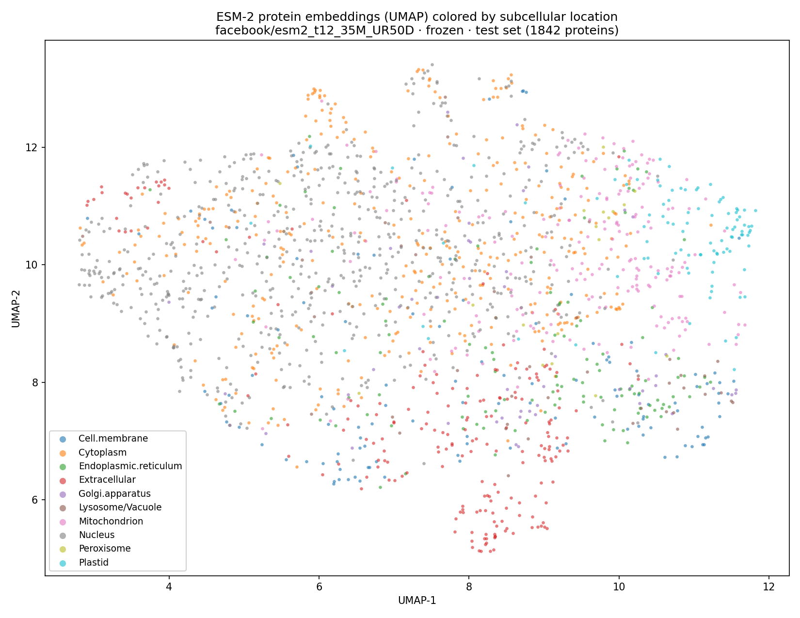

# Protein Subcellular Localization with ESM-2

Predict **where in the cell a protein localizes** — nucleus, mitochondrion, membrane,
and 7 other compartments — directly from its amino-acid sequence, by fine-tuning Meta AI's
[**ESM-2**](https://huggingface.co/facebook/esm2_t30_150M_UR50D) protein language model.

Knowing a protein's subcellular location is a real biological problem: it constrains the
protein's function, flags drug targets, and helps annotate the ~200M sequences in UniProt
that have never been studied in a lab.

### 🌐 [**→ Explore the interactive results dashboard**](https://claude.ai/code/artifact/d1e98f99-4bc4-47fc-af18-ee5eb840ac57)

A live, interactive page — embedding explorer, per-class F1, confusion matrix, and example
predictions — all built from real test-set outputs. *(Click the figure below to open it.)*

[](https://claude.ai/code/artifact/d1e98f99-4bc4-47fc-af18-ee5eb840ac57)

*Every point is a test-set protein, positioned by a 2-D UMAP of its **frozen** ESM-2
embedding and colored by its true compartment. The language model was never told what
"a mitochondrion" is, yet mitochondrial (pink), plastid (cyan), and extracellular (red)
proteins already separate — the transfer-learning signal that makes fine-tuning work.*

> The same dashboard also ships as a static site in [`docs/`](docs/index.html) — run it locally
> with `python -m http.server -d docs 8080`, or deploy free via **GitHub Pages**
> (*Settings → Pages → Deploy from branch → `main` / `docs`*).

## Results

Held-out **DeepLoc test set** (1,842 proteins, 10 classes). Random guessing ≈ 10% accuracy;
always predicting the majority class (Nucleus) ≈ 33%.

| Approach | Accuracy | Macro-F1 | MCC |
|---|---|---|---|
| Frozen ESM-2 (35M) + logistic regression — *measured* | **0.649** | **0.523** | **0.577** |
| Fine-tuned ESM-2 (150M), class-weighted — *run the notebook* | — | — | — |

The linear-probe row is a genuinely-measured baseline produced by this repo on a laptop in
minutes (`outputs/linear_probe_metrics.json`). It quantifies how much localization signal
ESM-2 already carries with **zero** task-specific training. Fine-tuning the 150M/650M model
(the Colab notebook) is expected to improve substantially on it; fill the second row in with
your own run rather than trusting a number you didn't measure.

## Dataset

[`proteinea/deeploc`](https://huggingface.co/datasets/proteinea/deeploc) — the **DeepLoc**
benchmark (Almagro Armenteros et al., 2017): SwissProt proteins with experimentally-supported
subcellular localization. `src/prepare_data.py` downloads it and carves a **stratified**
validation split out of the training data so model selection never sees the test set.

- **5,959** train / **663** val / **1,842** test
- **10** compartments, heavily imbalanced: Nucleus 35% → Peroxisome 0.8%
  (handled with an inverse-frequency **class-weighted loss** and reported via **macro-F1**,
  not just accuracy)

## Quickstart (local)

```bash
python -m venv venv && source venv/bin/activate
pip install -r requirements.txt

python src/prepare_data.py                                  # download DeepLoc -> data/*.csv
python src/embeddings.py --model facebook/esm2_t12_35M_UR50D # cache frozen embeddings
python src/linear_probe.py --model facebook/esm2_t12_35M_UR50D # baseline metrics
python src/umap_plot.py    --model facebook/esm2_t12_35M_UR50D # the embedding figure
```

## Fine-tune (Colab / GPU)

The full ESM-2 fine-tune wants a GPU. Open
[`notebooks/01_finetune_esm2.ipynb`](notebooks/01_finetune_esm2.ipynb) in Colab
(`Runtime → Change runtime type → T4 GPU`) and run all — it's self-contained and finishes in
~15–30 min. Or, on your own GPU:

```bash
python src/train.py        # config-driven; writes best_model/, metrics.json, and figures
```

Training behavior is controlled by [`configs/config.yaml`](configs/config.yaml) — model size,
`max_length`, class weighting, gradient accumulation/checkpointing, and W&B logging.

## Serve

```bash
MODEL_DIR=outputs/best_model uvicorn src.serve:app --reload
curl -X POST localhost:8000/predict -H 'content-type: application/json' \
     -d '{"sequence": "MALWMRLLPLLALLALWGPDPAAAFVNQHLCGSHLVEALYLVCGERGFFYTPKT", "top_k": 3}'
```

Returns ranked compartments with calibrated softmax confidences. The API validates
amino-acid symbols and exposes `/labels` and `/health`.

## Project layout

```
src/prepare_data.py   download DeepLoc, stratified split -> data/*.csv
src/data.py           load splits, label maps, tokenization
src/model.py          ESM-2 sequence-classification head
src/train.py          class-weighted fine-tuning; macro-F1/MCC; saves metrics + 4 figures
src/embeddings.py     mean-pooled frozen ESM-2 representations (cached)
src/linear_probe.py   frozen-embedding logistic-regression baseline
src/umap_plot.py      2-D embedding map colored by location
src/build_site.py     compute all website data -> docs/results.js
src/serve.py          FastAPI inference service
notebooks/            self-contained Colab fine-tuning notebook
docs/                 static results website (index.html + generated results.js)
```

The website reads whatever `src/build_site.py` last wrote, so after you fine-tune, re-run it
to refresh every chart with the better model — no HTML edits needed.

## Methodology notes

- **Honest metric.** With 35% of proteins in the nucleus, plain accuracy flatters a model.
  Selection and reporting use **macro-F1** and **MCC**, which weight rare compartments equally.
- **No test leakage.** Validation is carved from `train` only; the official `test` split is
  touched exactly once, at the end.
- **Imbalance handling.** Inverse-frequency class weights in the loss so Peroxisome (49
  training examples) isn't drowned out by Nucleus (2,080).

## Limitations

- DeepLoc assigns each protein a single primary location; some proteins are genuinely
  multi-localizing (see DeepLoc 2.0 for the multi-label formulation).
- Sequences are truncated to `max_length` (512 covers ~59% fully; 1024 covers ~89%).
- The linear-probe baseline uses the small 35M model for speed; larger ESM-2 variants embed
  more slowly but score higher.

## Citations

- Lin et al., *Evolutionary-scale prediction of atomic-level protein structure with a language
  model* (ESM-2), Science 2023.
- Almagro Armenteros et al., *DeepLoc: prediction of protein subcellular localization using deep
  learning*, Bioinformatics 2017.
