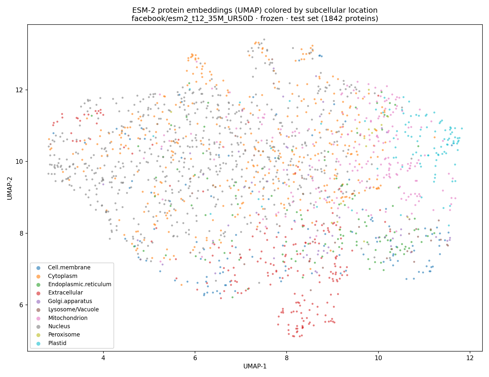

# Protein Subcellular Localization with ESM-2

Predict **where in the cell a protein localizes** — nucleus, mitochondrion, membrane,
and 7 other compartments — directly from its amino-acid sequence, by fine-tuning Meta AI's
[**ESM-2**](https://huggingface.co/facebook/esm2_t30_150M_UR50D) protein language model.

Knowing a protein's subcellular location is a real biological problem: it constrains the
protein's function, flags drug targets, and helps annotate the ~200M sequences in UniProt
that have never been studied in a lab.

### 🌐 [**→ Explore the interactive results dashboard**](https://larachieppe.github.io/protein-function-classifier/)

A live, interactive page — embedding explorer, per-class F1, confusion matrix, and example
predictions — all built from real test-set outputs. *(Click the figure below to open it.)*

[](https://larachieppe.github.io/protein-function-classifier/)

*Every point is a test-set protein, positioned by a 2-D UMAP of its **frozen** ESM-2
embedding and colored by its true compartment. The language model was never told what
"a mitochondrion" is, yet mitochondrial (pink), plastid (cyan), and extracellular (red)
proteins already separate — the transfer-learning signal that makes fine-tuning work.*

> The dashboard is the static site in [`docs/`](docs/index.html), served via GitHub Pages. Run it
> locally with `python -m http.server -d docs 8080`, and after fine-tuning re-run
> `python src/build_site.py` to refresh every chart.

## Results

Three localization tasks at increasing granularity, all measured on held-out test sets.

| Task | Classes | Model | Accuracy | Macro-F1 | MCC |
|---|---|---|---|---|---|
| Membrane vs. soluble | 2 | ESM-2 35M | 0.865 | 0.855 | 0.722 |
| **Compartment group** ⭐ | **4** | ESM-2 150M + attention pooling | **0.870** | **0.858** | 0.821 |
| Well-represented compartments | 7 | ESM-2 650M *(10-class model, rare classes dropped)* | 0.865 | 0.842 | **0.830** |
| Fine-grained localization | 10 | ESM-2 650M + attention pooling | 0.811 | 0.567 | 0.769 |

**The 4-class task is the headline result** — it groups the 10 compartments by *protein-targeting
pathway* (nucleus / cytoplasm / secretory & membrane / post-translationally imported organelles),
which is biologically meaningful rather than arbitrary. It is balanced (34/29/19/17%), every class
scores F1 0.71–0.93, and it runs on the small 150M model.

The **7-class** row is the same 10-class model scored only on the seven compartments it actually
predicts — the three rarest (Golgi, Lysosome/Vacuole, Peroxisome) receive *zero* predictions, so
dropping them loses no probability mass (asserted in `src/build_7class_view.py`). It isolates how
the model performs where it has enough data: macro-F1 jumps 0.567 → 0.842 and MCC to 0.830, the
best of any view. It is **not** a retrained model, and it is easier by construction.

Honest framing: 4-class scores higher than 10-class because the **task is easier**, not because the
model is better. The 10-class row is the hard version — 81.1% is within the published
state-of-the-art range for that benchmark, but optimizing it for raw accuracy (plain cross-entropy)
starves the three rarest classes (Peroxisome, Lysosome/Vacuole, Golgi) to near-zero recall, which is
why its macro-F1 is low. Grouping those rare compartments is what makes the 4-class task both
higher-scoring *and* better-behaved.

### 10-class progression (same test set)

| Approach | Accuracy | Macro-F1 | MCC |
|---|---|---|---|
| Frozen ESM-2 (35M) + logistic regression | 0.649 | 0.523 | 0.577 |
| Fine-tuned ESM-2 150M (CLS head, class-weighted) | 0.763 | 0.613 | 0.714 |
| Fine-tuned ESM-2 650M + attention pooling | 0.811 | 0.567 | 0.769 |

## Dataset

Two interchangeable 10-class DeepLoc sources (`src/prepare_data.py --source ...`):

| Source | Train | Test | Notes |
|---|---|---|---|
| `deeploc` — [`proteinea/deeploc`](https://huggingface.co/datasets/proteinea/deeploc) | 5,959 | 1,842 | canonical 2017 split |
| `deeploc-multi` — [`AI4Protein/DeepLocMulti`](https://huggingface.co/datasets/AI4Protein/DeepLocMulti) | 9,324 | 2,742 | **larger** split, ~2× the rare classes |

More training data is the biggest accuracy lever, so the training notebook uses **DeepLocMulti**.
Both are the same 10 compartments and heavily imbalanced (Nucleus ~30% → Peroxisome ~1%); their
test sets differ, so a DeepLocMulti number is comparable to papers using that split, not to the
2017 number.

## Quickstart (local)

```bash
python -m venv venv && source venv/bin/activate
pip install -r requirements.txt

python src/prepare_data.py                                  # download DeepLoc -> data/*.csv
python src/embeddings.py --model facebook/esm2_t12_35M_UR50D # cache frozen embeddings
python src/linear_probe.py --model facebook/esm2_t12_35M_UR50D # baseline metrics
python src/umap_plot.py    --model facebook/esm2_t12_35M_UR50D # the embedding figure
```

## Fine-tune (Colab / GPU)

The full ESM-2 fine-tune wants a GPU. Open
[`notebooks/01_finetune_esm2.ipynb`](notebooks/01_finetune_esm2.ipynb) in Colab
(`Runtime → Change runtime type → T4 GPU`) and run all — it's self-contained and finishes in
~15–30 min. Or, on your own GPU:

```bash
python src/train.py        # config-driven; writes best_model/, metrics.json, and figures
```

Training behavior is controlled by [`configs/config.yaml`](configs/config.yaml) — model size,
`max_length`, class weighting, gradient accumulation/checkpointing, and W&B logging.

## Serve

```bash
MODEL_DIR=outputs/best_model uvicorn src.serve:app --reload
curl -X POST localhost:8000/predict -H 'content-type: application/json' \
     -d '{"sequence": "MALWMRLLPLLALLALWGPDPAAAFVNQHLCGSHLVEALYLVCGERGFFYTPKT", "top_k": 3}'
```

Returns ranked compartments with calibrated softmax confidences. The API validates
amino-acid symbols and exposes `/labels` and `/health`.

## Run with Docker

Serve the API in a container — no local Python or dependency install needed. This
uses the **Compose plugin** built into modern Docker, so invoke it as
`docker compose` (a subcommand), **not** the old standalone `docker-compose`
binary (deprecated, and usually not installed). With Docker Desktop you also don't
need `sudo`. Verify your setup with `docker version` and `docker compose version`.

```bash
docker compose up -d --build          # build the image and start the API
curl localhost:8000/health            # {"status": ..., "model_loaded": ...}
docker compose logs -f api            # follow logs
docker compose down                   # stop and remove
```

The service listens on **http://localhost:8000**. Once a model is available (see
below):

```bash
curl -X POST localhost:8000/predict -H 'content-type: application/json' \
     -d '{"sequence": "MALWMRLLPLLALLALWGPDPAAAFVNQHLCGSHLVEALYLVCGERGFFYTPKT", "top_k": 3}'
```

### Providing a model

`outputs/`, `data/`, and `configs/` are **mounted from the host**, so the model
lives outside the image. The API loads it from `MODEL_DIR` (default
`outputs/best_model`). Fine-tuning needs a GPU, so the usual flow is to train in
Colab / on a GPU box and drop the resulting `best_model/` into `outputs/`. Until a
model is present the container still starts and `/health` reports
`"model_loaded": false`, while `/predict` returns `503`. Point at a different
location with:

```bash
MODEL_DIR=outputs/my_model docker compose up -d
```

### Running the pipeline in the container

The image has every dependency, so you can run the one-off scripts through Compose
(`--rm` removes the throwaway container afterwards); outputs are written back to
your host `data/` and `outputs/` via the mounts:

```bash
docker compose run --rm api python src/prepare_data.py  --source deeploc-multi
docker compose run --rm api python src/embeddings.py    --model facebook/esm2_t12_35M_UR50D
docker compose run --rm api python src/linear_probe.py  --model facebook/esm2_t12_35M_UR50D
docker compose run --rm api python src/umap_plot.py     --model facebook/esm2_t12_35M_UR50D
```

The image is CPU-only; for the full ESM-2 fine-tune use Colab or a GPU host.

## Project layout

```
src/prepare_data.py   download DeepLoc, stratified split -> data/*.csv
src/data.py           load splits, label maps, tokenization
src/model.py          ESM-2 sequence-classification head
src/train.py          class-weighted fine-tuning; macro-F1/MCC; saves metrics + 4 figures
src/embeddings.py     mean-pooled frozen ESM-2 representations (cached)
src/linear_probe.py   frozen-embedding logistic-regression baseline
src/umap_plot.py      2-D embedding map colored by location
src/build_site.py     compute all website data -> docs/results.js
src/serve.py          FastAPI inference service
notebooks/            self-contained Colab fine-tuning notebook
docs/                 static results website (index.html + generated results.js)
```

The website reads whatever `src/build_site.py` last wrote, so after you fine-tune, re-run it
to refresh every chart with the better model — no HTML edits needed.

## Methodology notes

- **Honest metric.** With 35% of proteins in the nucleus, plain accuracy flatters a model.
  Selection and reporting use **macro-F1** and **MCC**, which weight rare compartments equally.
- **No test leakage.** Validation is carved from `train` only; the official `test` split is
  touched exactly once, at the end.
- **Imbalance handling.** Inverse-frequency class weights in the loss so Peroxisome (49
  training examples) isn't drowned out by Nucleus (2,080).

## Limitations

- DeepLoc assigns each protein a single primary location; some proteins are genuinely
  multi-localizing (see DeepLoc 2.0 for the multi-label formulation).
- Sequences are truncated to `max_length` (512 covers ~59% fully; 1024 covers ~89%).
- The linear-probe baseline uses the small 35M model for speed; larger ESM-2 variants embed
  more slowly but score higher.

## Citations

- Lin et al., *Evolutionary-scale prediction of atomic-level protein structure with a language
  model* (ESM-2), Science 2023.
- Almagro Armenteros et al., *DeepLoc: prediction of protein subcellular localization using deep
  learning*, Bioinformatics 2017.
