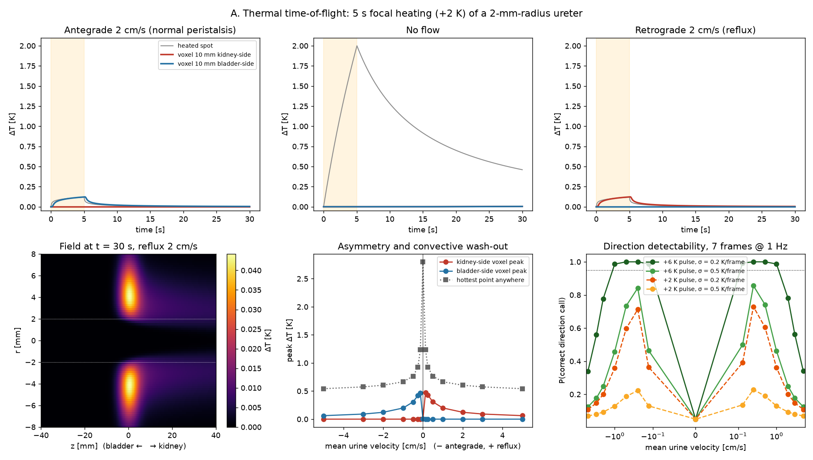
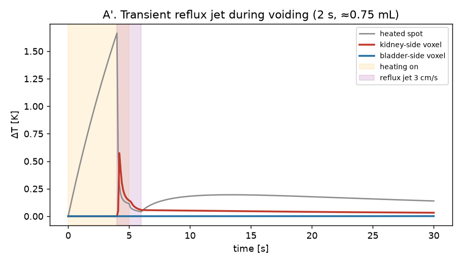
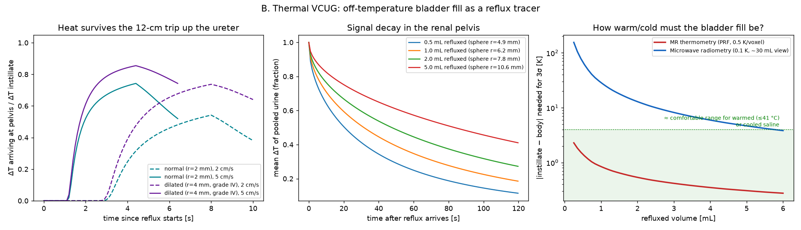

# Bioheat exploration: using heat to track the direction of kidney reflux

> A side exploration that lives in this repo but is unrelated to the protein classifier.
> Everything here is a first-pass physics model, not validated against data.

**Question.** In vesicoureteral reflux (VUR), urine flows backwards from the bladder up the
ureter towards the kidney. Today, VUR is diagnosed with a voiding cystourethrogram (VCUG,
which uses X-ray contrast and ionising radiation) or with contrast-enhanced voiding
urosonography (ceVUS, which uses microbubbles). **Could a temperature tracer show which
way urine is moving instead, without radiation or contrast agent?**

`bioheat_reflux.py` couples the **Pennes bioheat equation** in the tissue to **advection
by urine** in the ureter lumen. It runs on an axisymmetric (r, z) finite-volume grid.

```
ρc (∂T/∂t + u·∇T) = ∇·(k∇T) + ω_b ρ_b c_b (T_a − T) + Q
```

It tests two protocols:

| | Protocol | Heat source | Readout |
|---|---|---|---|
| **A** | *Thermal time-of-flight* | 5 s focused heating (for example, focused ultrasound) of a 1.5 mm spot on the ureter | Two thermometry voxels, 10 mm kidney-side and 10 mm bladder-side |
| **B** | *Thermal VCUG* | Bladder filled with saline a few K warmer or cooler than the body, then the patient voids | Temperature change in the renal pelvis |

Run `python bioheat_reflux.py` (about 40 s, needs numpy/scipy/matplotlib). It writes the
figures below, `results.json` and `thermal_reflux_tracer.html`, an interactive version of
this write-up built from `page_template.html`.

Shareable page: https://claude.ai/artifact/3itkJkM3wrfbf47kkctBza

## Why this can work: the dimensionless numbers

| Flow regime | u | Péclet (10 mm) | Transit time / radial diffusion time |
|---|---|---|---|
| Mean urine production (1 mL/min, 2 mm lumen) | 0.13 cm/s | ~90 | 1.6 |
| Peristaltic bolus | 2.5 cm/s | ~1,700 | 0.08 |
| Voiding reflux jet | 5 cm/s | ~3,500 | 0.04 |

Even the slowest flow has a Péclet number far above 1, so moving urine carries heat
**hundreds of times further than it diffuses**. The direction of the heat plume therefore
shows the direction of flow almost perfectly. The open question is whether there is enough
signal, not which way it points. Two more facts matter:

- Heat leaks from the urine into the ureter wall in about **5 s**.
- Perfusion clears heat from the surrounding tissue over about **18 min**, so it plays
  little part on these timescales.

## A. Thermal time-of-flight



- **The direction call is clean.** Under reflux, only the kidney-side voxel warms. Under
  antegrade flow, only the bladder-side voxel warms. With no flow, neither moves by more
  than 0.004 K, because diffusion covers only about 4 mm in 30 s.
- **Faster flow gives a weaker signal.** The heat is spread over more urine, so the bulk
  temperature rise scales roughly as ΔT ≈ P/(ρc·Q). With the gentle pulse (+2 K at the
  focus with no flow), the downstream voxel peaks at:
  - 0.47 K at 0.13 cm/s
  - 0.12 K at 2 cm/s
  - 0.06 K at 5 cm/s

  The flow also cools the focus, from 2.8 K down to 0.55 K. That drop is itself a flow
  meter, like thermal-clearance anemometry, but it does not give direction.
- **Detectability** (7 frames at 1 Hz, 5% false-positive rate):

  | Pulse | Thermometry noise | Reliable range (≥ 90%) |
  |---|---|---|
  | +6 K | 0.2 K per frame | 0.13–1 cm/s; 78% at 2 cm/s, 34% at 5 cm/s |
  | +6 K | 0.5 K per frame (typical MR thermometry) | Never reliable; at most about 86% (at 0.25 cm/s) |

  The +6 K pulse briefly brings tissue to about 43–45 °C. Its thermal dose is
  **CEM43 = 0.22 min**, compared with roughly 240 min for damage to muscle and fat.
  The gentle +2 K pulse gives 0.001 min.
- **"Heat, then wait" works better than heating flowing urine** (figure below). Heating the
  urine while it is still, then letting the first reflux jet push the warm slug past the
  sensor, gives a **0.57 K** spike on the kidney side only, even with the gentle pulse.
  However, the spike lasts less than 1 s, so the readout needs a frame rate of about 5 Hz or
  faster.



## B. Thermal VCUG



- **Transit.** Over a 12 cm (paediatric) ureter, the urine reaching the renal pelvis keeps
  **51–69%** of the bladder's temperature offset in a normal 2 mm-radius ureter. In a
  dilated 4 mm ureter (grade IV) it keeps **70–81%**. The more severe the reflux, the
  stronger the signal.
- **Persistence.** Once refluxed urine pools in the renal pelvis, it keeps **57–79%** of its
  offset after 15 s and **25–57%** after 60 s, for pools of 0.5 to 5 mL. That leaves
  plenty of time to image.
- **Bladder offset needed for a 3σ detection 15 s after reflux:**

  | Refluxed volume | MR thermometry (PRF shift, 0.5 K per voxel) | Microwave radiometry (0.1 K, ~30 mL field of view) |
  |---|---|---|
  | 0.5 mL | 1.4 K | ~70 K ✗ |
  | 1 mL | 0.8 K | ~29 K ✗ |
  | 2 mL | 0.5 K | ~13 K ✗ |
  | 5 mL | 0.3 K | ~4.7 K (marginal) |

  **MR thermometry works with an offset of only a few kelvin.** Saline at 30–33 °C, or
  41 °C, would be enough. Cool saline is attractive because it adds no thermal dose at all.
  Passive microwave radiometry loses too much signal because its field of view is much
  larger than the reflux volume.

## Verdict

1. **The physics is favourable.** Advection completely dominates heat transport in the
   ureter, so a heat tracer gives an unambiguous direction signal, and the tissue stays well
   within safe limits.
2. **Readout is the bottleneck, not heating.** Each protocol fits a different situation:
   - **Protocol B with MR thermometry** looks most practical. It is a "contrast-free MR
     voiding cystography" that only needs a bladder fill a few degrees off body
     temperature.
   - **Protocol A** suits intra-operative or catheter-based settings, where a thermistor or
     fibre-optic sensor with about 0.05 K noise turns the 0.1–0.5 K plume into a decisive
     signal.
3. **The main risks the model leaves out:**
   - **Motion during voiding** corrupts PRF-shift thermometry. This is probably the biggest
     practical problem.
   - **The ureter is not a steady tube.** It collapses between peristaltic boluses, and a
     collapsed lumen carries no advected heat.
   - **Fat** has no PRF thermometry signal, and the renal sinus is fatty.
   - **Kidney cortex perfusion** is about 100× higher than the tissue value used here. This
     matters only if the refluxed urine sits right against the parenchyma.
   - **Competition.** ceVUS already avoids radiation, so thermal VCUG's advantages are
     having no agent at all and giving a quantitative volume estimate.

## Possible next steps

- Fit the model to published ureteral peristalsis data (bolus volume, frequency and
  collapse), and replace steady Poiseuille flow with travelling boluses.
- Simulate the full chain: bladder heat loss during filling and voiding, then the real
  renal-pelvis shape from a segmented MR or CT scan.
- Model ultrasound echo-shift thermometry. It would fit a ceVUS-like bedside workflow if
  it can manage noise below 0.5 K.
- Run a bench phantom: a silicone tube in a perfused tissue mimic, a syringe pump for
  forward and reverse flow, and a fibre-optic or MR thermometry readout.
